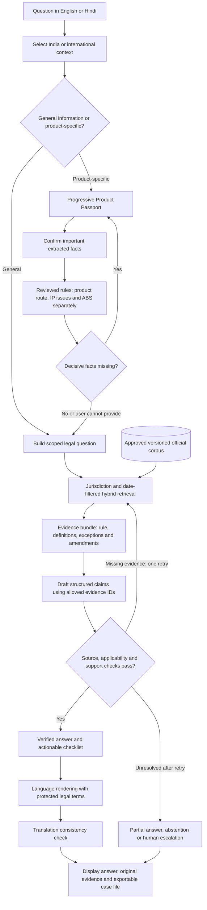

# IP-SAKTI Sahayak — Research-backed solution and recommended changes

Team Naut IQ · SIH 26045 · Research review: 9 September 2026

## 1. Recommendation

Build an **evidence-first Ayurveda IP and regulatory guidance platform**: a source-versioned legal retrieval system combined with expert-reviewed decision rules, multilingual interaction, and human escalation.

The central product is a **Product Passport → Evidence-backed Action Plan**, not an unrestricted legal chatbot. Users should understand which routes may apply, what facts remain unknown, which official provisions support the guidance, and whom to approach next.

Keep the existing four-module structure and modular-monolith architecture. Strengthen the classification logic, provision-level retrieval, verification and evaluation before adding more agents or infrastructure.

This is the strongest practical design I recommend from this review—not an experimentally proven “best” system. The papers below support individual techniques; none validates this complete Indian Ayurveda/IP/ABS solution. This is a targeted literature review, not an exhaustive systematic review. Legal rules require qualified review before deployment; this document is an engineering proposal, not legal advice.

## 2. Research papers worth using

### R1. Hallucination-Free? Assessing the Reliability of Leading AI Legal Research Tools

Magesh et al., 2024 research paper. [Paper](https://arxiv.org/abs/2405.20362) · [Author-hosted full text](https://law.stanford.edu/wp-content/uploads/2024/05/Legal_RAG_Hallucinations.pdf)

- Evidence: a preregistered evaluation found substantial hallucinations in the commercial legal RAG systems tested. Retrieval did not eliminate unsupported legal answers.
- Application: require claim-level evidence checks and safe abstention; never advertise IP-SAKTI as hallucination-free.
- Limitation: the evaluated tools, legal tasks and study period differ from our application. Their error rates are not predictions of our performance or current vendor quality.
- Owners: C and D.

### R2. Enabling Large Language Models to Generate Text with Citations — ALCE

Gao et al., EMNLP 2023. [Paper and publication record](https://aclanthology.org/2023.emnlp-main.398/)

- Evidence: evaluates generated answers across correctness and citation quality, including whether cited material supports claims and whether claims have sufficient citations.
- Application: measure citation correctness and citation completeness separately. A working URL is not proof of support.
- Limitation: general question answering does not establish that a statute is in force, applicable to the user, or legally controlling.
- Owners: C, with A exposing evidence clearly.

### R3. LegalBench-RAG: A Benchmark for Retrieval-Augmented Generation in the Legal Domain

Pipitone and Alami, 2024 arXiv preprint. [Paper](https://arxiv.org/abs/2408.10343) · [Full text](https://arxiv.org/html/2408.10343v1)

- Evidence: offers 6,858 query–answer pairs with annotated relevant legal text spans, emphasizing precise retrieval rather than merely finding the right document.
- Application: annotate the exact provisions needed for each IP-SAKTI test case and score retrieval independently of answer generation.
- Limitation: its corpus is not our Indian Ayurveda corpus. Transfer the evaluation methodology, not its legal answers.
- Owner: C.

### R4. M3-Embedding: Multi-Linguality, Multi-Functionality, Multi-Granularity Text Embeddings Through Self-Knowledge Distillation

Chen et al., 2024 paper; commonly associated with BGE-M3. [Paper](https://arxiv.org/abs/2402.03216) · [Official model](https://huggingface.co/BAAI/bge-m3)

- Evidence: develops multilingual embeddings supporting dense, sparse and multi-vector retrieval across different text lengths.
- Application: use BGE-M3 dense embeddings as an initial multilingual retrieval candidate, combined with lexical search and reranking.
- Limitation: broad multilingual benchmark performance does not establish legal Hindi, Sanskrit terminology or Ayurveda retrieval accuracy. Validate on our cases before selecting it permanently.
- Owner: C.

### R5. Self-RAG: Learning to Retrieve, Generate, and Critique through Self-Reflection

Asai et al., ICLR 2024; initial preprint 2023. [Paper](https://arxiv.org/abs/2310.11511) · [Conference full text](https://proceedings.iclr.cc/paper_files/paper/2024/file/25f7be9694d7b32d5cc670927b8091e1-Paper-Conference.pdf)

- Evidence: trains models to use reflection tokens for adaptive retrieval and generation assessment.
- Application: borrow the principle of checking evidence sufficiency and performing a bounded retrieval repair when support is missing.
- Limitation: a critique prompt is not an implementation or reproduction of Self-RAG. We should not train a reflection-token model for the MVP or claim its published results.
- Owner: C.

### R6. From Local to Global: A Graph RAG Approach to Query-Focused Summarization

Edge et al., 2024 paper. [Paper](https://arxiv.org/abs/2404.16130)

- Evidence: uses graph construction and community summaries for questions requiring global understanding of large corpora.
- Application: consider graph-assisted exploration later for relationships among ingredients, sources, provisions, authorities and obligations.
- Limitation: global summarization benefits do not demonstrate better exact statutory citation. Graph summaries must never replace the original provision as legal evidence.
- Owners: B and C.

### R7. IndicTrans2: Towards High-Quality and Accessible Machine Translation Models for all 22 Scheduled Indian Languages

Gala et al., initial preprint 2023; arXiv record reports acceptance at TMLR. [Paper](https://arxiv.org/abs/2305.16307) · [Official implementation](https://github.com/AI4Bharat/IndicTrans2)

- Evidence: releases translation models, training data and evaluation resources covering 22 scheduled Indian languages.
- Application: evaluate IndicTrans2 as a translation option behind a provider adapter; retain BHASHINI as the planned national-language integration route.
- Limitation: BHASHINI and IndicTrans2 are not interchangeable names. General translation quality does not certify preservation of legal conditions, negations or botanical names.
- Owners: A and C.

### R8. Semantic Annotation and Querying Framework based on Semi-structured Ayurvedic Text

Terdalkar et al., preprint 2022; publication listed in the 2023 Computational Sanskrit & Digital Humanities proceedings. [Paper](https://arxiv.org/abs/2202.00216)

- Evidence: manually annotates a chapter of Bhavaprakashanighantu, producing a curated ontology, 410 entities, 764 relationships and template-based querying.
- Application: create a small, reviewed Ayurveda terminology layer connecting names, substances and textual references. Preserve ambiguity instead of automatically merging similar names.
- Limitation: this is directly relevant Ayurveda knowledge engineering, but not legal classification, patentability assessment or evidence of therapeutic efficacy. Check data licensing before reuse.
- Owners: B and C.

### R9. Legal RAG Bench: an end-to-end benchmark for legal RAG

Abdur-Rahman Butler and Umar Butler, March 2026 arXiv preprint. [Paper](https://arxiv.org/abs/2603.01710) · [Methods and results](https://arxiv.org/html/2603.01710v1)

- Evidence: compares retriever–generator combinations on 100 Victorian criminal-law questions and decomposes retrieval, grounding and reasoning failures. Retriever choice materially affected results in this experiment.
- Application: test the retrieval layer independently and run controlled component comparisons before spending on a larger generator.
- Limitation: small, jurisdiction-specific study with automated judging; authors are associated with a vendor whose model is evaluated. It does not establish the best embedding model for India.
- Owner: C.

### What the literature does—and does not—justify

Together, these papers support testing precise retrieval, verifiable citations, multilingual handling and curated relationships. They do not justify autonomous legal decisions, guaranteed correctness, unrestricted TKDL ingestion, or choosing GraphRAG simply because it is newer. The design below is our engineering synthesis, not a published architecture proven for this problem statement.

## 3. Recommended end-to-end solution

### 3.1 Progressive Product Passport

Do not make someone complete a formulation questionnaire to ask “What is a trademark?” Collect facts only when they affect the requested guidance.

For product-specific cases, progressively capture intended use and claims, dosage form, formulation/text reference, ingredients and plant parts, manufacturing changes, applicant characteristics, biological-resource origin, activity, target country, and relevant dates. Ask about publication/disclosure only when relevant to an IP assessment.

The LLM may extract proposed facts; the user confirms decisive ones. Unknown facts stay unknown. Avoid requesting exact confidential formulation ratios unless necessary and explicitly consented to.

### 3.2 Separate three assessments

1. **Regulatory route:** provisional route and unmet eligibility conditions.
2. **IP opportunity/risk:** potentially relevant rights, prior-art questions and evidence needed—not a promise of patentability.
3. **ABS obligations:** fact-specific checkpoints and unresolved conditions—not an automatic “compliant” certificate.

Use source-linked rules with `met / not_met / unknown` condition values. Version each ruleset. Show the facts and legal provisions behind a result. A legal expert must review the decision tables; deterministic code alone does not make a rule legally correct.

Important correction: a formulation that is not clearly classical and does not satisfy phytopharmaceutical criteria must not automatically become a proprietary Ayurvedic medicine. Each route needs its own eligibility check; an unresolved/outside-supported-scope route is essential. CDSCO distinguishes traditional and patent/proprietary definitions, and separately describes phytopharmaceutical criteria. [Traditional-drug definitions](https://www.cdsco.gov.in/opencms/opencms/en/Traditional_Drugs/) · [Phytopharmaceutical FAQ](https://cdsco.gov.in/opencms/resources/UploadCDSCOWeb/2018/UploadAlertsFiles/Phyto.pdf)

Likewise, “patent or proprietary medicine” is a regulatory label, not confirmation of an actual patent. Keep Ayurveda Aahara and other food/nutraceutical routes separately identifiable; the Aahara regulations have their own scope and exclusions. [FSSAI notification](https://fssai.gov.in/upload/notifications/2022/05/62789a20b54bdGazette_Notification_Ayurveda_Aahara_09_05_2022.pdf)

### 3.3 Evidence retrieval that respects law and language

- Ingest provisions and their parent context, not arbitrary PDF pages alone. Preserve definitions, provisos, schedules, tables and exceptions.
- Store original files, hashes, extraction quality, source URLs, provision IDs, language, jurisdiction, publication dates, effective intervals and ingestion timestamps.
- Use separate approved corpus namespaces/filters for India, treaty frameworks and specific export jurisdictions. “International” is not one universal market-access rulebook.
- Distinguish treaty adoption, entry into force and country participation; unknown status must block country-specific assertions.
- Retrieve with the original query and, where useful, a reviewed English translation. Preserve scientific names, numbers, negation and section references.
- Fuse lexical and vector rankings, rerank candidates, and expand only necessary parent/definition/exception links within an evidence budget.
- Keep judgments with court hierarchy, jurisdiction, procedural status and affected provisions. Do not reduce legal authority to a simplistic document-type ranking.
- Treat retrieval failure as “not found in the approved corpus,” never “no law/prior art exists.”

An evidence bundle should record the applicable proposition, its conditions, exceptions, temporal scope, supporting excerpts and unresolved conflicts. Community-generated graph summaries are navigation aids, not legal authority.

### 3.4 Verification and answer format

Generate structured atomic claims referencing only retrieved source IDs. First run mechanical checks: valid ID, exact excerpt/offset, correct source version, permitted jurisdiction, no invented URL. Then assess whether the evidence supports the claim, including conditions and exceptions.

Semantic verification can itself fail. Use it with expert-reviewed tests, not as a guarantee. Permit one bounded retrieval-repair attempt; otherwise clarify, omit the unsupported claim, or escalate. Do not stream unverified legal prose—stream progress, then validated sections.

The result should contain:

- A short answer and provisional route, if relevant.
- Facts relied upon and missing facts.
- Separate regulatory, IP and ABS sections.
- Supported next steps with official links.
- Source excerpts, provisions, version dates and review status.
- Explicit uncertainty and a human-escalation option.
- Standing “information, not legal advice” notice.

Use **evidence-support indicators**, such as “supported within reviewed scope,” “missing facts” and “conflicting sources.” Do not show invented percentage confidence. If probability scores are later added, calibrate them on held-out expert-labelled cases and publish their limitations.

### 3.5 Language, privacy and corpus maintenance

Start with English and Hindi. Protect legal names, botanical entities and numerical thresholds during translation; test meaning with bilingual reviewers. Back-translation is a diagnostic, not proof. Preserve original evidence beside translated explanations.

Use approved public sources first. TKDL and paid databases need access-rights checks; never assume public descriptions authorize bulk ingestion. Paid-source connectors remain permissioned, logged and license-aware.

Separate public-corpus caching from private case data. Minimize retained formulations, redact operational logs, enforce tenant isolation, and send sensitive data to external model/translation services only under the chosen consent and data-handling policy. Do not use user cases as training data by default.

Detect official-source changes, stage them for curator review, rebuild affected provisions and rerun related tests before promotion. Track publication and commencement separately. Do not freeze the legal corpus at the dates in the PS: NBA already lists the 2025 ABS Regulations. This confirms an update requirement, not a complete current-law audit. [NBA notifications](https://nbaindia.nic.in/public-information/notification-guidelines)

## 4. Changes recommended against our existing plan

These are proposed design corrections, not changes already implemented in software. The PPT and existing module documents have been left unchanged.

| Existing approach | Recommendation | Why / owner |
|---|---|---|
| Simplified six-category classification flow | Independent eligibility conditions, explicit unknown branch and reviewed source-linked decision tables | Avoid false default classification; B |
| Product class drives IP posture | Assess regulatory route, patent/IP questions and ABS separately | Prevent category-to-patentability shortcuts; B |
| Passport-led interaction | Add a general-information route; collect facts progressively | Less friction and less confidential data collection; A/B |
| Broad food/nutraceutical grouping | Keep Aahara eligibility and other food routes distinct | Different legal scope; B/C |
| “PostgreSQL full-text/BM25-style” indexing | Call baseline PostgreSQL FTS accurately; add real BM25 only as an explicit tested component | PostgreSQL ranking functions are not automatically BM25; C |
| Hybrid retrieval already planned | Add original-plus-translated query tests and reviewed Ayurveda aliases | Better handling of local names and exact legal terms; C |
| General confidence labels | Explain evidence support and missing facts; calibrate numerical scores only later | Avoid false precision; A/C |
| Streaming answer | Stream progress, then verified legal sections | Unsupported text should not reach the user first; A/C |
| Evaluation listed late in part of the master priority map | Start gold cases and regression tests in Phase 0 | Catch source/rule errors before UI polish; C/D |
| Version tracking already planned | Enforce provision-level effective time plus ingestion time and court-status metadata | Better historical and amended-law handling; C/D |
| Graph/agentic layers already deferred | Keep deferred; use a small curated relationship table first and one bounded repair loop | Fewer moving parts; graph benefit must be measured; B/C |
| Broad accuracy and latency targets | Treat them as unmeasured acceptance goals, reported by risk and language slice | A single average can conceal dangerous failures; C/D |

PostgreSQL documents `ts_rank` and `ts_rank_cd` as its text-search ranking functions. A BM25 claim requires a separately selected implementation. [Official documentation](https://www.postgresql.org/docs/current/textsearch-controls.html)

Keep unchanged: the A/B/C/D ownership model, Next.js + FastAPI, PostgreSQL + pgvector, official-source citations, explicit jurisdiction separation, user-controlled escalation, and staged delivery. These are sound foundations; a wholesale redesign is unnecessary.

## 5. Modules and implementation stack

| Module | Build responsibility | Initial implementation choice |
|---|---|---|
| A — Frontend | Chat, progressive Passport, jurisdiction selector, evidence cards, uncertainty and export UI | Next.js, TypeScript, Tailwind CSS; typed API contracts |
| B — Backend/domain | Case APIs, confirmed facts, three-valued rules, independent IP/ABS routing, escalation | FastAPI, Pydantic, SQLAlchemy/Alembic; versioned JSON decision tables |
| C — AI/knowledge | Ingestion, provision parsing, aliases, hybrid retrieval, reranking, verified answers, translation and evaluation | PostgreSQL FTS + pgvector; BGE-M3 candidate; benchmark-selected reranker and generator; provider adapters |
| D — Platform | Identity, consent, access control, curator approvals, audit, backups and deployment | Docker Compose; object storage for source originals; CI tests; secrets management |

Start with one backend and one ingestion worker. Introduce Redis when job coordination or measured caching needs justify it. Use relational `entities`, `aliases`, `relations` and `relation_evidence` tables before a separate Neo4j deployment. A typed state machine is enough initially; LangGraph is optional orchestration, not a requirement for correctness.

The generator and reranker are deliberately not declared “best” by name: compare candidates on our benchmark, cost, hardware and privacy constraints. Pin selected model revisions before implementation. Do not assume a self-hosted embedding/reranking workload will meet latency targets without measuring available hardware.

Existing separate documents: [A](modules/MODULE_A_FRONTEND.md), [B](modules/MODULE_B_BACKEND_DOMAIN.md), [C](modules/MODULE_C_AI_RAG.md), [D](modules/MODULE_D_PLATFORM_SECURITY.md). Use section 4 of this report as the proposed amendment list when updating them.

## 6. Build phases and exit conditions

### Phase 0 — Establish trustworthy scope

Choose the exact Indian product scenarios, initial IP/ABS questions and one limited international scenario. Assemble a permitted corpus, source-linked rules, shared JSON contracts and an initial 30 expert-reviewed cases. Review corpus completeness and legal effective dates. If expert review is unavailable, label outputs as an unvalidated prototype and restrict supported scope.

Exit: each supported rule and expected test answer has traceable authority; unknown cases have defined behavior.

### Phase 1 — End-to-end demonstrator

Build English chat, progressive Passport, separate jurisdiction contexts, hybrid retrieval, source cards, partial abstention and evidence export. Demonstrate two fully checked product journeys rather than implying all categories and countries are covered. All six requested category labels may appear, but unsupported routes must explicitly escalate.

Exit: repeatable live journeys and failure cases, with no fabricated evidence IDs or hidden unsupported scope.

### Phase 2 — Validate the core

Add deeper IP routing, reviewed ABS condition tables, claim verification, date-sensitive tests, corpus-change regression and curator approval. Grow the benchmark to approximately 150 base cases and run controlled comparisons.

Exit: a signed-off evaluation report with failures, uncertainty and per-slice results—not just a dashboard score.

### Phase 3 — Hindi and focused international coverage

Add terminology protection, bilingual retrieval, translation checks and country-specific adapters. Keep treaty guidance and export-market rules visibly separate. Add voice after text quality passes; confirm transcribed critical facts before reasoning.

Exit: bilingual reviewers accept meaning preservation for supported tasks; jurisdiction switching passes adversarial tests.

### Phase 4 — Evidence-driven expansion

Add additional countries/languages, licensed connectors and graph-assisted multi-hop retrieval only when access and evaluation justify them. Harden operations, data protection, deletion, backup restore and incident handling before a real-user pilot.

Exit: measured improvement or justified operational need for each added component. Timelines depend on source access, legal reviewers and team capacity; research does not establish a universal 24-hour production roadmap.

## 7. How we determine whether this is actually better

Create about 150 expert-reviewed base cases: 35 classification, 30 IP/TK, 25 ABS, 20 jurisdiction/export, 20 date/exception/conflict, and 20 unanswerable/adversarial cases. Categories may carry additional risk tags. Add paired Hindi variants to a representative subset; do not count translations as independent legal cases.

Keep development and blind-test case families separate. Have reviewers resolve disputed gold answers. Store required facts, acceptable outcomes, decisive evidence spans, exceptions and expected abstention. Authorities remain available to the retriever; the blind element is the test questions and answer labels. Include amendment scenarios to test obsolete versions.

Measure:

- Evidence-span recall and irrelevant context retrieved.
- Expert-assessed answer correctness and application to the supplied facts.
- Citation support precision and material-claim citation coverage.
- Unsafe confident answers, missed abstentions and unnecessary abstentions.
- India/international leakage and obsolete-law usage.
- Hindi/English meaning agreement, including negation and entities.
- End-to-end latency, cost per answered case and human-escalation frequency.

Compare a fixed corpus/generator across: dense-only retrieval; lexical + dense; reranking; legal-date/exception expansion; verifier + bounded retry; bilingual query expansion. Then test generator alternatives with the retrieval setup fixed. Evaluate the graph layer separately on genuinely multi-hop cases. Keep mandatory production guardrails in place; weaker experimental variants run offline only.

Choose the simplest configuration that meets agreed quality and cost gates. Suggested pilot gates are at least 95% citation support precision, at least 95% material-claim coverage and at least 90% required-abstention recall, subject to expert agreement. These are proposed thresholds, not achieved results or published guarantees. Any observed critical fabricated authority or wrong-jurisdiction obligation blocks release pending correction. Zero observed errors on a small test set does not mean zero real-world risk.

## 8. Best SIH demonstration and differentiator

Demonstrate a founder asking a Hindi question about an Ayurvedic product. The assistant asks only decisive questions, shows a provisional route with reasons, separately identifies IP and ABS issues, and opens exact official evidence. Change one important fact and show the resulting rule/evidence difference. Switch to a supported export jurisdiction and show a separate evidence set. Finish with an incomplete-facts question that the system safely refuses to resolve.

The defensible differentiator is **a multilingual, jurisdiction-aware and time-aware evidence trail from product facts to next steps**. It is not merely having RAG, agents or a graph. Do not claim this is the world's first system; this review does not establish that.

The next development action should be Phase 0: approve supported scenarios, legal decision tables, source versions, shared schemas and gold test cases. Then build one verified vertical slice across A → B → C, with D controls throughout.
