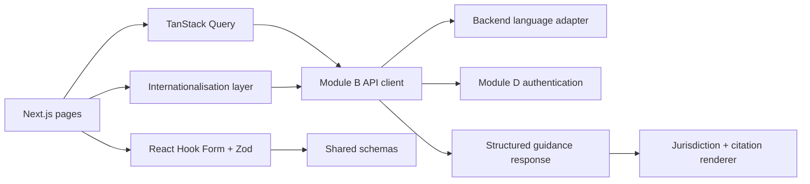

# Module A — Frontend and User Experience

**26 September 2026 audit:** This specification is not a completion certificate. Current fixes, tested scope and remaining production gates are recorded in [the release audit](../RELEASE_AUDIT_2026-09-26.md). Local guest access and source-text pilot evidence do not satisfy real identity or expert legal approval requirements.

**Revision:** 2 · 9 September 2026. Updated implementation specification, not implemented application code. [Research and change rationale](../IP-SAKTI_RESEARCH_AND_SOLUTION.md). These revised module documents supersede conflicting details in the older master blueprint.

**Owner:** Frontend team  
**Primary stack:** React, JavaScript, Vite, CSS, accessible UI components, TanStack Query, React Hook Form, Zod and i18next (per the requested React/JavaScript implementation)
**Depends on:** Module B APIs, Module C answer/citation schema and Module D authentication/consent

## 1. Objective

Build a multilingual progressive web application that converts a complicated legal/regulatory journey into a guided case workflow. The frontend must make product classification, jurisdiction, citations, missing facts, uncertainty and human escalation visible.

The interface must not resemble a simple chatbot. Chat is one input method inside a structured case workspace.

## 2. Frontend submodules

### A1 — Landing, scope and onboarding

**Screens:**

- Landing page
- Supported use cases and jurisdictions
- Information-not-legal-advice notice
- Privacy notice and consent screen
- Sign-in/guest-demo entry

**Responsibilities:**

- Explain what the assistant can and cannot do
- Show the disclaimer before the first question
- Capture the notice/consent version through Module D
- Avoid collecting product secrets on the public landing page

**Acceptance criteria:**

- User cannot start a saved case until required consent is recorded.
- Disclaimer remains accessible from every result page.
- Guest demo data is visibly marked as temporary.

### A2 — Language and voice experience

**SIH languages:** English and Hindi.

**Features:**

- UI language selector
- Text input in both languages
- Optional BHASHINI speech-to-text and text-to-speech
- Loading, timeout and retry states for external speech services
- Original query, normalized query and translated explanation controls
- Legal glossary tooltips
- Original-language source passage display

**Critical rule:** Language and jurisdiction are separate controls. Hindi does not automatically mean India, and English does not automatically mean international.

**Acceptance criteria:**

- Equivalent Hindi and English inputs produce the same provisional classification when facts match.
- Citation locator, title and official URL are never altered by translation.
- User can disable voice processing.

### A3 — Case workspace

**Purpose:** Provide a persistent container for one product or research question.

**Components:**

- Case title, status and last-updated time
- Product Passport completion meter
- India/international workspace selector
- Conversation and clarification timeline
- Current classification and missing-fact summary
- Saved guidance versions
- Export and escalation actions

**Statuses:**

`Draft → Needs information → Assessed → Guidance ready → Under human review → Reviewed → Archived`

General-information questions can proceed directly to Guidance ready without a Passport. Show jurisdiction/framework, supported scope and as-of date. Unsupported routes are visible states, not successful classifications.

### A4 — Product Passport wizard

First distinguish `GENERAL_INFORMATION` from `PRODUCT_SPECIFIC`. General questions bypass this wizard. Collect only facts needed for the active assessment, and require user confirmation of decisive model-extracted facts. Preserve unknown facts; do not repeatedly ask questions the user cannot answer. Exact confidential ratios are not required by default.

**Wizard sections:**

1. Intended use and claims
2. Dosage form and administration
3. Formula or process source
4. Ingredients and biological origin
5. Modification, extraction, isolation or standardisation
6. Available safety/efficacy/quality evidence
7. Applicant/organisation facts needed for ABS routing
8. Development and commercial stage
9. Intended Indian and export markets
10. Existing publications, disclosures or filings

**UX rules:**

- Ask no more than three related questions on one screen.
- Show why a sensitive or legal-routing fact is requested.
- Save after every step.
- Use conditional branches so irrelevant questions are skipped.
- Mark required, optional and “needed to resolve this assessment” differently.
- Let the user answer “I do not know”; never force a fabricated fact.
- Display provenance: user-entered, extracted or facilitator-confirmed.

**Core components:**

```text
PassportStepper
ConditionalQuestionGroup
IngredientEditor
BiologicalOriginEditor
ClaimEditor
EvidenceUploader
FactProvenanceBadge
MissingFactPanel
PassportReview
```

### A5 — Classification and jurisdiction view

**Purpose:** Show independent regulatory, IP and ABS assessments. A product category is not a patentability decision or an ABS clearance. Display each rule condition as `met`, `not_met` or `unknown`, with evidence links. Keep Ayurveda Aahara and other food/nutraceutical subroutes distinct; permit unresolved/outside-supported-scope results.

**Display:**

- Candidate route
- Plain-language explanation
- Triggering facts
- Missing or contradictory facts
- Ruleset version
- “Provisional classification” label
- Request-review action

**Jurisdiction firewall UI:**

- Separate `India` and `International / target country` tabs
- Different accent labels and breadcrumbs
- Jurisdiction badge on every answer section and citation
- Comparison view created only from already validated answer sets
- Separate treaty-framework guidance from country-specific market-access guidance
- Changing jurisdiction, decisive facts or date invalidates incompatible results; never relabel old guidance

### A6 — Guidance and evidence viewer

**Required sections:**

1. Provisional product route
2. Immediate next actions
3. Potential IP protection
4. ABS and traditional-knowledge checkpoints
5. Regulatory/licensing/evidence checklist
6. Labelling and advertising risks
7. Target-market considerations
8. Missing information
9. Human-review recommendation

**Citation card fields:**

- Authority
- Source title
- Section/rule/article/form locator
- Supporting passage
- Effective/version date
- Official source link
- Jurisdiction
- Retrieval date

**Evidence-support display:**

Use `SUPPORTED_IN_SCOPE`, `MISSING_FACTS`, `MISSING_EVIDENCE`, `CONFLICTING_SOURCES`, `OUT_OF_SCOPE` or `REVIEW_REQUIRED`, with plain-language reasons. These are evidence states, not probabilities of legal correctness. Never invent confidence percentages.

Stream progress only until a section passes verification. Render legal prose only from `section_verified` or `answer_complete` events. Partial answers keep unresolved sections visible. Citation cards additionally show provision ID, original excerpt, effective interval (including unknown), review status and answer as-of date.

**Failure states:**

- No current source found
- Source conflict
- Missing material fact
- Unsupported jurisdiction
- Restricted source needs permission
- Translation unavailable
- Human review required

### A7 — Case file, export and facilitator handoff

**Features:**

- Saved answer versions
- Checklist with open/completed actions
- Source snapshot list
- Export as HTML/PDF/JSON
- “Share with facilitator” consent screen
- Escalation status and reviewer comments
- Delete/export personal data controls

**Export must contain:**

- Product facts used
- Provisional classification
- Separate jurisdiction sections
- Citations and source versions
- Missing facts and risks
- Disclaimer
- Generation timestamp

## 3. Suggested routes

```text
/
/about
/privacy
/login
/cases
/cases/new
/cases/[caseId]
/cases/[caseId]/passport
/cases/[caseId]/classification
/cases/[caseId]/guidance
/cases/[caseId]/evidence
/cases/[caseId]/export
/cases/[caseId]/review
/facilitator/queue
/settings/language
/settings/privacy
```

## 4. Frontend architecture



## 5. Frontend state

**Server state:** cases, passport versions, classification runs, guidance answers, citations and escalations. Manage with TanStack Query.

**Form state:** current Product Passport step and unsaved validation state. Manage with React Hook Form and Zod.

**Local UI state:** open citation, selected tab, speech playback and filters. Keep local; do not duplicate server data in a global store.

**Sensitive data rule:** Do not persist formula text or access tokens in browser local storage.

## 6. API integration contract

```text
POST /api/v1/cases
GET  /api/v1/cases/{id}
POST /api/v1/cases/{id}/passport/answers
GET  /api/v1/cases/{id}/passport
POST /api/v1/cases/{id}/classify
POST /api/v1/cases/{id}/guidance
GET  /api/v1/answers/{id}
GET  /api/v1/answers/{id}/citations
POST /api/v1/cases/{id}/escalations
POST /api/v1/cases/{id}/exports
```

Generate the TypeScript API client from Module B's OpenAPI schema to prevent field-name drift.

## 7. SIH implementation priority

### Must build

- Landing/disclaimer
- English/Hindi text interface
- Case creation
- Product Passport wizard
- Jurisdiction switch
- Classification result
- Structured guidance view
- Expandable citation cards
- Evidence-support/abstention view
- Checklist export

### Build if time allows

- Voice input/output
- Saved case history
- Facilitator queue
- Side-by-side jurisdiction comparison

### Later

- More languages
- Offline PWA caching for non-sensitive help content
- Collaborative organisation workspace
- Full accessibility certification

## 8. Frontend tests

- Conditional wizard paths
- Form validation and autosave
- Jurisdiction badge on every claim
- Citation card opens the correct passage
- Hindi/English switch preserves case data
- Voice consent and cancellation
- API timeout/retry handling
- Keyboard navigation and focus order
- Mobile/tablet/desktop responsiveness
- No sensitive fields in analytics events
- Export and delete flows

## 9. Module A definition of done

- [ ] User completes a Product Passport without technical help.
- [ ] Only relevant clarifying questions are shown.
- [ ] India and international views cannot be confused.
- [ ] Every material claim renders its citations.
- [ ] Missing facts and abstention are as visible as successful answers.
- [ ] Hindi and English produce consistent UI state.
- [ ] No sensitive case data is stored in local storage or analytics.
- [ ] The main demo works on a laptop and mobile-sized viewport.
- [ ] General questions work without a Passport; extracted decisive facts require confirmation.
- [ ] No draft legal text leaks during streaming, retry or reconnect.
- [ ] Date/jurisdiction changes cannot show stale answers under new labels.

## 10. Updated phases and contracts

- **Phase 0:** Mock shared B/C contracts and tests for general, product-specific, partial and unsupported cases.
- **Phase 1:** English vertical slice with two reviewed journeys, progressive questions, verified citations and export.
- **Phase 2:** Independent assessment panels, fact/version history and facilitator handoff.
- **Phase 3:** Bilingual-reviewed Hindi, then voice and one supported export-country interface.
- **Phase 4:** More languages and collaboration only after measured quality gates.

Use Module B's `GuidanceRequest`, `DomainAssessment`, `EvidenceSupportAssessment` and `GuidanceEvent`, and Module C's claim/citation contracts. Passport/classification IDs may be null for general questions. Backend services derive source permissions; the UI cannot grant them.

Call language providers through backend adapters. Confirm transcribed botanical names, numbers, negation and decisive facts before reasoning. Preserve original evidence if translation fails; show a warning. Back-translation alone does not establish meaning preservation. Do not expose provider credentials in browser code.
