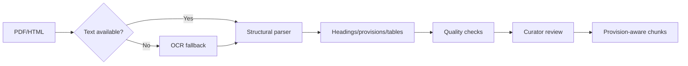
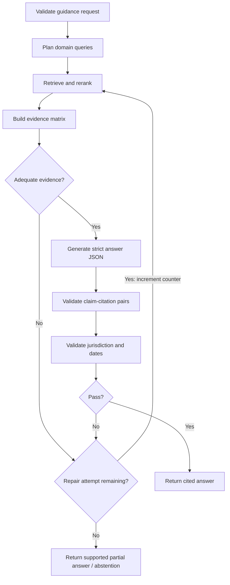

# Module C — AI, RAG and Knowledge System

**Implementation update — 24 September 2026:** The local extractive retrieval baseline is now implemented. See [actual delivery, tests and remaining work](MODULE_C_IMPLEMENTATION_STATUS.md). The specification below remains the full target; semantic RAG, multilingual translation and expert benchmark gates are not claimed complete.

**Revision:** 2 · 9 September 2026. Updated implementation specification, not implemented application code. [Research and change rationale](../IP-SAKTI_RESEARCH_AND_SOLUTION.md). These revised module documents supersede conflicting details in the older master blueprint.

**Owner:** AI and data team  
**Primary stack:** Python, PostgreSQL FTS/pgvector, provision-aware parsers, BGE-M3 dense embedding candidate, benchmark-selected reranker/generator and typed workflow; LangGraph optional  
**Consumes:** Structured route and jurisdiction requests from Module B  
**Returns:** Evidence-supported claims, citations, evidence-support states and abstention reasons

## 1. Objective

Build a versioned, authoritative-source retrieval and answer system in which the language model explains evidence but does not invent the legal route.

The module must answer four questions for every output:

1. Which product/jurisdiction/domain context was searched?
2. Which source versions were used?
3. Which passage supports each claim?
4. Why did the system answer, clarify, abstain or escalate?

## 2. AI/RAG submodules

### C1 — Authoritative source registry

**Source metadata:**

- Authority and title
- Source type
- Jurisdiction and domain
- Official URL
- Publication, effective and supersession dates
- Language
- Public/restricted/user-licensed access class
- Checksum and immutable storage key
- Curator/review status
- Relationship to previous versions
- Provision-level valid-from/valid-to intervals, including unknown commencement, separately from ingestion timestamps
- Court hierarchy, jurisdiction, procedural status and affected provisions for judgments
- Treaty adoption, entry-into-force and participation metadata where relevant

**Initial source families:**

- India Code and IP India statutes/rules
- AYUSH drug law and standards
- FSSAI regulations/orders
- National Biodiversity Authority Acts, rules, regulations, FAQs and forms
- Public registry/form information
- WIPO treaty texts/status and filing systems
- CBD/Nagoya sources
- Selected judgments after legal curation

### C2 — Fetch, upload and version-detection service

**Responsibilities:**

- Fetch only allowlisted official sources or accept curator uploads
- Record HTTP metadata and retrieval time
- Hash the original document
- Detect duplicate or silently replaced files
- Create a new source version without overwriting history
- Queue parsing and curator review

Do not automatically publish a changed legal document into production retrieval.

### C3 — Legal document parser and OCR

**Pipeline:**



**Requirements:**

- Preserve section, rule, article, form and page locators.
- Keep provisos/explanations connected to their parent provision.
- Store table structure and readable text.
- Mark OCR-derived text and OCR confidence.
- Keep the original file immutable.
- Reject pages with insufficient text coverage until reviewed.

### C4 — Chunking and indexing

**Chunking strategy:**

- Prefer one complete provision or a coherent provision subsection.
- Attach parent heading and source metadata.
- Permit limited overlap only at structural boundaries.
- Do not use arbitrary fixed-token chunks for legal texts.
- Store character/page offsets for citation highlighting.

**Indexes:**

1. Metadata and exact identifier index
2. PostgreSQL full-text search using ts_rank/ts_rank_cd for the baseline; these are not BM25
3. pgvector multilingual semantic index
4. Optional OpenSearch only when corpus/traffic requires it

Add real BM25 only as an explicitly selected, benchmarked implementation. Preserve original excerpts and parent/definition/exception links. Legal applicability filters must constrain candidate retrieval, not merely be applied to an already truncated vector result set.

### C5 — Query planner

The planner receives query kind, jurisdiction, domains, as-of date and questions from B. Passport/classification are optional for general information.

**Responsibilities:**

- Create separate queries per domain
- Add mandatory jurisdiction/effective-date filters
- Expand controlled synonyms and bilingual legal terms
- Preserve exact provision, ingredient, form and authority names
- Exclude unauthorised source classes
- Refuse unsupported target countries
- Test original-language and translated-English queries together; fuse and deduplicate results
- Use reviewed botanical aliases, plant parts and textual references; preserve unresolved identity ambiguity

The planner may use an LLM for query rewriting only after deterministic filters are fixed.

### C6 — Hybrid retriever and reranker

**Retrieval sequence:**

1. Filter by jurisdiction, domain, date and access class.
2. Match exact titles, identifiers and locators.
3. Retrieve lexical candidates.
4. Retrieve vector candidates.
5. Merge using reciprocal-rank fusion.
6. Rerank with a multilingual cross-encoder.
7. Check legal applicability, effective intervals and authority relationships; court status cannot be reduced to a document-type weight.
8. Select diverse passages with adequate context.

**Reason:** Exact legal identifiers and botanical names favour lexical search, while paraphrased multilingual questions benefit from vectors.

Expand candidate provisions to required definitions, exceptions and amendments within a bounded evidence budget. If missing context remains, mark the evidence incomplete. “Not retrieved” never means “no law or prior art exists.”

### C7 — Evidence matrix builder

Before generation, create an internal evidence table:

| Candidate claim | Jurisdiction | Domain | Supporting passages | Authority | Current | Conflict |
|---|---|---|---|---|---|---|

**Rules:**

- A material claim needs direct evidence.
- A secondary explanation cannot override primary law.
- Missing support removes the claim or triggers clarification.
- Conflicting current primary sources trigger human review.
- Facts inferred from the Product Passport must be labelled as user facts, not legal-source facts.
- Store conditions, exceptions, effective interval and unresolved conflicts per proposed claim.
- Keep court interpretation/status separate from statutory text; unresolved controlling-authority questions require review.

### C8 — Answer orchestration

Use a typed state machine; LangGraph is optional. Maintain a per-run repair counter: at most one additional retrieval attempt, then partial answer, clarification or escalation. Do not describe a prompted critique as a reproduction of the trained Self-RAG method.



**Generation constraint:** The model receives the structured Product Passport summary and approved evidence matrix—not arbitrary corpus dumps.

Draft atomic `AnswerClaim` objects referencing only retrieved evidence IDs. Stream progress events until verification; only then publish `section_verified` or `answer_complete`. Preserve unresolved claims in the support assessment rather than inventing completion.

### C9 — Citation engine and verifier

**Citation fields:**

```json
{
  "source_version_id": "uuid",
  "authority": "",
  "title": "",
  "locator": "Section/Rule/Article",
  "page": 0,
  "passage": "",
  "official_url": "",
  "provision_id": "uuid",
  "valid_from": null,
  "valid_to": null,
  "temporal_status": "UNKNOWN",
  "review_status": "PENDING",
  "retrieved_at": "ISO-8601",
  "jurisdiction": "IN"
}
```

**Verification:**

- Entailment: passage supports the claim
- Locator: passage corresponds to the displayed section/page
- Currency: source was current for the requested date
- Jurisdiction: claim and source jurisdictions match
- Coverage: all material claims have citations
- Access: user had permission to use the source

First validate IDs, exact excerpts/offsets, permissions and applicability mechanically. Then assess semantic support, conditions and exceptions. Unknown commencement blocks date-specific conclusions. A semantic verifier can fail: it is a tested risk control, not a correctness guarantee.

`AnswerClaim` contains claim_id, section_id, text, jurisdiction_context, evidence_refs, fact_refs and support_assessment. `Citation` resolves to immutable source/provision versions and original passages. Follow B's shared `EvidenceSupportAssessment` and `GuidanceEvent` contracts; expose no raw draft tokens.

### C10 — Evidence support, abstention and safety policy

**Evidence-support states:** `SUPPORTED_IN_SCOPE`, `MISSING_FACTS`, `MISSING_EVIDENCE`, `CONFLICTING_SOURCES`, `OUT_OF_SCOPE`, `REVIEW_REQUIRED`.

Attach reasons and unresolved claim IDs at section and answer level. A supported section may coexist with unresolved sections. These states are not probabilities of legal correctness. Numerical confidence requires later calibration on held-out expert-labelled cases; never derive it directly from similarity scores.

**Abstain when:**

- No current official evidence is found
- Material facts are missing
- Source conflict cannot be resolved
- Requested jurisdiction is unsupported
- Restricted source access is unavailable
- Citation validation fails
- User requests a definitive legal opinion

### C11 — Multilingual translation guard

- Maintain a reviewed legal glossary.
- Preserve identifiers and authority names.
- Retrieve original authoritative text.
- Show the original cited passage.
- Back-check classification-critical translations.
- Mark untranslated terms instead of inventing equivalents.
- Score meaning preservation separately from fluency.
- Evaluate IndicTrans2 behind a provider adapter alongside the planned BHASHINI integration; they are not interchangeable products.
- Protect negations, thresholds, botanical names and section references; bilingual reviewers validate critical meaning.
- Back-translation is diagnostic, not proof. Confirm decisive extracted/transcribed facts with the user via A/B.

### C12 — Knowledge graph

**Phase:** After the retrieval MVP meets its metrics.

Start with curated PostgreSQL `entities`, `aliases`, `relations` and `relation_evidence` tables. Preserve provenance and identity ambiguity. Introduce Neo4j only after a multi-hop benchmark demonstrates benefit.

**Suggested relationships:**

```text
PROVISION -[:APPLIES_TO]-> PRODUCT_CLASS
PROVISION -[:REQUIRES]-> FORM
RULE -[:AMENDS]-> RULE
SOURCE -[:SUPERSEDES]-> SOURCE
INGREDIENT -[:DERIVED_FROM]-> BIOLOGICAL_RESOURCE
ACTIVITY -[:MAY_REQUIRE]-> ABS_ROUTE
TREATY -[:IMPLEMENTED_BY]-> NATIONAL_MEASURE
IP_ROUTE -[:LIMITED_BY]-> EXCLUSION
```

Use graph results to plan multi-hop retrieval, not as uncited answer authority.

### C13 — Evaluation harness

**Phase 0 requirement:** Start with approximately 30 expert-reviewed cases before route implementation. Expand to about 150 base cases: 35 classification, 30 IP/TK, 25 ABS, 20 jurisdiction/export, 20 dates/exceptions/conflicts and 20 unanswerable/adversarial. Add representative Hindi pairs; do not count translations as independent legal cases.

Split development and blind-test case families; adjudicate disputed labels. Store facts, acceptable outcomes, decisive evidence spans, exceptions and expected abstention. Test authorities remain accessible to retrieval; blind questions/answers do not enter prompts or tuning.

**Benchmark categories:**

- Six product routes
- Patent and traditional-knowledge exclusions
- ABS user/activity combinations
- Ambiguous and incomplete cases
- India/international separation
- Advertising and labelling risks
- Hindi/English equivalents
- Superseded sources
- Out-of-scope questions
- Prompt-injection attempts

**Target pilot metrics:**

| Metric | Target |
|---|---:|
| Citation precision | ≥95% |
| Material-claim citation coverage | ≥95% |
| Jurisdiction mixing | 0 critical instances |
| Unsupported-answer abstention recall | ≥90% |
| Source-version traceability | 100% |
| Hindi classification consistency | ≥90% versus English equivalent |

Targets are release gates, not claims about an untested prototype.

Also measure answer correctness, evidence-span recall, unnecessary abstention, unsafe confident answers, obsolete-law use, latency and cost by risk/language slice. Any observed critical fabricated authority or wrong-jurisdiction obligation blocks release. Zero observed failures is not proof of zero risk.

Run offline ablations with a fixed corpus/generator: dense baseline → lexical+dense → reranking → legal context expansion → verifier/one repair → bilingual queries. Compare generators only after fixing retrieval; evaluate graph additions on multi-hop cases. Report failures and uncertainty, not only averages. Never deploy unguarded experimental variants to users.

## 3. Model strategy

Use model interfaces rather than hardcoding a single vendor/model:

```text
EmbeddingProvider.embed(texts, language, model_version)
Reranker.rank(query, passages, model_version)
Generator.generate(schema, evidence, context, model_version)
Verifier.verify(claims, citations, model_version)
Translator.translate(text, source_lang, target_lang, glossary_version)
```

Start by measuring BGE-M3 dense retrieval as a candidate, not an assumed winner. Select and pin embedding, reranking and generator revisions using the benchmark, privacy constraints, cost and available hardware. Local inference via vLLM is optional when feasible; managed processing requires approved data handling. Do not promise an unmeasured latency target.

## 4. Data ownership

Module C owns:

- `source_records`
- `source_versions`
- `provisions`
- `provision_embeddings`
- `retrieval_runs`
- `retrieval_candidates`
- `answer_versions`
- `answer_claims`
- `claim_citations`
- `evaluation_cases`
- `evaluation_runs`

Private Product Passport data remains case data and must never become part of the shared legal corpus.

## 5. Internal APIs

```text
POST /internal/v1/guidance
GET  /internal/v1/guidance/{run_id}
POST /internal/v1/retrieval/search
POST /internal/v1/citations/verify
POST /internal/v1/evaluations/run

POST /api/v1/admin/sources
POST /api/v1/admin/sources/{id}/versions
POST /api/v1/admin/source-versions/{id}/parse
POST /api/v1/admin/source-versions/{id}/approve
POST /api/v1/admin/indexes/rebuild
```

## 6. SIH corpus strategy

Do not ingest thousands of uncontrolled documents. Start with a small, representative corpus containing the exact provisions needed for two or three demo routes:

- Patents Act and relevant rules
- AYUSH drug definitions/requirements
- FSSAI Ayurveda Aahara definition/requirements
- Biological Diversity Act/Rules and NBA guidance
- Applicable later amendments/regulations, including review of the 2025 ABS Regulations; the corpus must not stop at the PS's 2024 references
- WIPO GRATK treaty page/text
- Selected portal/form metadata

Quality and traceability are more valuable than corpus size.

## 7. Tests

- Parser preserves locator and page
- Superseded source excluded for current-date query
- Jurisdiction filters cannot be bypassed
- Exact section/form names are retrieved
- Hindi paraphrase retrieves same authority
- Claim without supporting passage is removed
- Wrong citation is rejected
- Restricted source excluded without permission
- Source conflict escalates
- Prompt injection inside source text is ignored
- Full benchmark runs in CI after corpus/model/prompt changes

## 8. Module C definition of done

- [ ] Every source is versioned and checksummed.
- [ ] Every provision retains an official locator.
- [ ] Retrieval applies jurisdiction, date and access filters before vectors.
- [ ] Answer generation uses an evidence matrix.
- [ ] Every material claim has a verified citation.
- [ ] Unsupported requests safely abstain.
- [ ] Model, prompt, corpus and ruleset versions are traceable.
- [ ] Benchmark results are reproducible.
- [ ] One-repair limit is enforced and unverified text never reaches A.
- [ ] Missing effective dates and unresolved exceptions block unsupported claims.
- [ ] Original/translated retrieval and botanical ambiguity have regression cases.

## 9. Updated phases

- **Phase 0:** Approved source inventory, provision schema, reviewed rules/evidence alignment and 30 gold cases.
- **Phase 1:** English retrieval/citation vertical slice for two supported product journeys and general queries.
- **Phase 2:** Independent retrieval/answer tests, applicability expansion, verification, bounded repair and approximately 150-case evaluation.
- **Phase 3:** Bilingual-reviewed Hindi and focused country/treaty corpus adapters; voice follows text validation.
- **Phase 4:** Licensed connectors, further languages and graph expansion only when permissions and measured benefit justify them.
