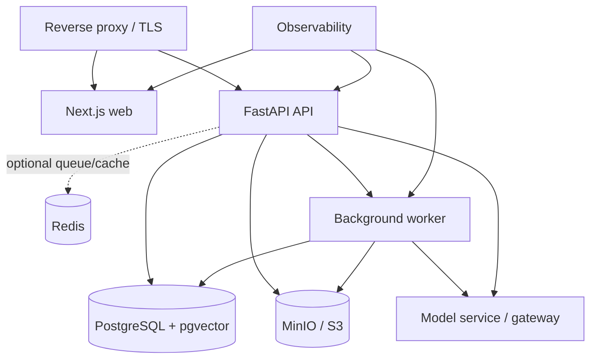

# Module D — Security, Administration, Deployment and Operations

**26 September 2026 audit:** This specification is not a completion certificate. Current fixes, tested scope and remaining production gates are recorded in [the release audit](../RELEASE_AUDIT_2026-09-26.md). Local guest access and source-text pilot evidence do not satisfy real identity or expert legal approval requirements.

**Revision:** 2 · 9 September 2026. Updated implementation specification, not implemented application code. [Research and change rationale](../IP-SAKTI_RESEARCH_AND_SOLUTION.md). These revised module documents supersede conflicting details in the older master blueprint.

**Owner:** DevOps, security and QA team  
**Primary stack:** Docker Compose, PostgreSQL, object storage, Auth.js/approved identity provider, CI/CD, OpenTelemetry and secrets management; Redis and separate graph infrastructure optional  
**Applies to:** Modules A, B and C

## 1. Objective

Provide the trustworthy operating foundation: identity, privacy, source administration, restricted connectors, audit, secure deployment, monitoring, backups and release controls.

Security cannot be added after the AI workflow is complete because case data may contain personal information, biological-resource details and proprietary formulations.

## 2. Platform/security submodules

### D1 — Authentication and session management

**Prototype:** Auth.js or equivalent rapid authentication.

**Pilot:** Keycloak or an approved enterprise identity provider with MFA and organisation roles.

**Requirements:**

- Secure cookies and short-lived sessions
- MFA for facilitators, curators and administrators
- Account lockout/rate limits
- Session revocation
- Service identities for workers
- No authentication token in browser local storage

### D2 — Authorisation and tenant isolation

**Roles:**

```text
GUEST
USER
ORGANISATION_MEMBER
FACILITATOR
CORPUS_CURATOR
ADMINISTRATOR
AUDITOR
```

**Controls:**

- RBAC plus organisation ownership checks
- PostgreSQL row-level security where practical
- Deny-by-default internal APIs
- Separate public corpus from private case storage
- Source-access permissions passed to Module C
- Audit privileged access

### D3 — Privacy, notice and consent

Design for the Digital Personal Data Protection Act, 2023 and phased Digital Personal Data Protection Rules, 2025.

Maintain a qualified-review compliance checklist tied to actual commencement dates; this architecture alone is not proof of legal compliance or standards certification.

**Separate consent purposes:**

- Account and case operation
- Voice/audio processing
- Sharing with a facilitator
- Paid/restricted source access
- Optional product improvement feedback

**Requirements:**

- Clear, purpose-specific notice
- Versioned consent event
- Withdrawal comparable in ease to granting consent
- Data export and deletion request
- Retention schedule by data category
- No training on private cases by default
- Telemetry redaction
- Documented processor/subprocessor list for pilot
- Explicit external model/translation processing controls for confidential case content
- Public-corpus caches separated from tenant-scoped private results; no cross-tenant semantic case cache
- Exact formulation ratios collected only when necessary; no private cases used as training data by default
- Retention/deletion applies to private exports, caches and provider copies where applicable; distinguish public source history from deletable personal data

### D4 — Secret and connector management

**Responsibilities:**

- Store BHASHINI, model and database credentials in a secrets manager
- Rotate credentials
- Never expose secrets to frontend code
- Use per-environment configuration
- Isolate user-provided paid-source credentials
- Revoke connector access immediately on user request

### D5 — Paid/restricted source permission service

**Workflow:**

1. User selects a connector.
2. UI displays source, purpose, data requested and storage policy.
3. User explicitly authorises a defined scope.
4. Credential/token is stored in the secrets manager.
5. Module C receives a short-lived access grant, not the raw credential.
6. Every query is audited.
7. User can revoke the grant.

**TKDL rule:** No bulk scraping, copying or redistribution. Implement pointer mode first; add an authorised connector only when access terms and credentials permit it.

### D6 — Corpus curator console

**Features:**

- Register an official source
- Upload/fetch a new source version
- Compare checksums and text differences
- Review OCR/parser quality
- Mark effective/superseded dates
- Approve or reject publication
- Trigger re-indexing
- Run affected benchmark tests
- Roll back a corpus release

Store publication, provision-level effective interval, ingestion time and legal review separately. Unknown commencement is an explicit state. Review court hierarchy/status and treaty participation where applicable. Require reviewed rule/evidence compatibility before promotion; invalidate affected cached guidance. Cover later amendments rather than freezing the corpus at 2024.

Only approved source versions may enter the production retrieval index.

### D7 — Facilitator administration

- Review queue configuration
- Assignment and service-level status
- Reviewer identity verification
- Comment/correction workflow
- Correction reason codes
- Immutable record of assistant versus reviewed output
- Feedback export to the evaluation system after approval

### D8 — Audit and provenance service

**Audit fields:**

- Actor/service and organisation
- Action and timestamp
- Object and version
- Product Passport/classification/answer references
- Ruleset, corpus, prompt and model versions
- Source permissions used
- Consent event
- Human correction
- Export/deletion action
- Integrity hash or protected log sequence
- Query kind, as-of date, support state, verification result and repair-attempt count
- Translation/glossary revision and confirmed-fact references, without raw sensitive content

Do not put raw proprietary formulas or full prompts into general logs.

### D9 — Application security controls

- TLS in transit
- Strong encryption at rest
- Least privilege
- Input size/type validation
- Malware scanning for uploads
- Allowlisted source domains
- Prompt-injection/content sanitisation controls
- Rate limiting
- CSRF/XSS/SQL injection protection
- Secure headers and CSP
- Dependency/container scanning
- Signed builds where available
- Backup encryption
- Incident-response contacts and runbook

### D10 — Deployment environments

```text
local       Developer machines and unit tests
demo        SIH deployment with synthetic/demo data
staging     Production-like integration and evaluation
pilot       Limited real users and approved corpus
production  Only after legal/security/operational approval
```

Never use real user secrets or production connector credentials in demo/staging.

### D11 — Container and deployment design



**SIH:** Docker Compose on one capable host.

Start with one backend and one worker, PostgreSQL/pgvector and object storage. Use a durable PostgreSQL-backed job table with leasing, retry limits and idempotency if Redis is omitted. A local filesystem source store is acceptable only for a controlled demo with explicit backup handling. Introduce Redis/Neo4j only for demonstrated requirements.

**Pilot:** Managed PostgreSQL, S3-compatible storage and container deployment. Use Kubernetes only when actual scale or organisational policy justifies it.

### D12 — CI/CD and release governance

**Pull-request checks:**

- Formatting/linting
- Unit and integration tests
- API contract compatibility
- Database migration validation
- Secret detection
- Dependency/container vulnerability scan
- RAG benchmark subset
- Licence/source-access checks

**Release checks:**

- Full expert benchmark
- Citation precision gate
- Jurisdiction separation gate
- Privacy/security approval
- Corpus version freeze
- Rollback package
- Demo/staging smoke test
- Phase-0 gold tests and scenario coverage recorded before expansion
- Per-risk/language evaluation report, including unsafe answers and unnecessary abstentions
- No observed critical fabricated authority or wrong-jurisdiction obligation in the release suite; any instance blocks promotion
- Verified-only streaming, bounded repair and stale-answer invalidation tests

Treat numerical quality targets as proposed gates, not achieved performance. Zero observed failures on a finite suite is not a guarantee. Run weaker ablation configurations offline only. Source, ruleset, model, prompt or glossary changes require affected tests; full release testing remains mandatory.

### D13 — Observability

**Metrics:**

- API latency/error rate
- Retrieval empty-result rate
- Citation validation failures
- Abstention/escalation rate
- Language and jurisdiction usage
- Source freshness/broken links
- Queue depth and ingestion failure
- Model latency/token/cost
- End-to-end cost per answered case, evidence-support states and exhausted repair attempts
- Authentication/permission failures

**Tracing:** Use privacy-safe correlation IDs across A → B → C. Do not record full sensitive content by default.

### D14 — Backup, recovery and continuity

- Automated database backups
- Versioned object storage
- Encrypted backup location
- Periodic restore tests
- Recovery objectives defined for pilot
- Offline SIH demo fixture
- Cached non-sensitive source extracts for external-API failure
- Documented recovery and credential-rotation runbook

### D15 — Source freshness monitor

**Responsibilities:**

- Check official source pages on a schedule
- Detect link failure, checksum change or new publication
- Create a curator review task
- Mark potentially stale answers/corpus releases
- Re-run affected evaluation cases after approval

The monitor must not automatically declare a legal amendment effective based only on webpage change detection.

## 3. Docker Compose services for SIH

```text
web          Next.js frontend
api          FastAPI backend
worker       ingestion/export jobs
postgres     relational data + pgvector
redis        optional cache/queue when justified
minio        source and export object storage
model        optional local inference server
proxy        TLS/routing where required
```

## 4. Environment configuration

```text
APP_ENV
DATABASE_URL
REDIS_URL
OBJECT_STORAGE_ENDPOINT
OBJECT_STORAGE_BUCKET
MODEL_PROVIDER
MODEL_ENDPOINT
EMBEDDING_MODEL
RERANKER_MODEL
BHASHINI_USER_ID
BHASHINI_API_KEY
AUTH_ISSUER
AUTH_CLIENT_ID
OTEL_EXPORTER_ENDPOINT
```

Commit only an `.env.example` containing names and safe descriptions. Never commit secret values.

## 5. Threat scenarios

| Threat | Control |
|---|---|
| User reads another organisation's case | Tenant checks, row-level policies and access tests |
| Formula appears in telemetry | Structured redaction and sensitive-field logging ban |
| Uploaded document contains malware | File allowlist, scan, sandboxed parsing and size limits |
| Retrieved PDF contains prompt injection | Treat retrieved content as untrusted data and disable tool authority |
| Curator publishes wrong/superseded source | Four-eyes approval, dates, diff and regression tests |
| Paid source queried without permission | Short-lived scoped grants and audit |
| Admin credential stolen | MFA, least privilege, rotation and alerting |
| External language/model API unavailable | Timeouts, retries, circuit breaker and offline demo |
| Source website silently replaces a PDF | Checksum/version detection and manual approval |

## 6. SIH implementation priority

### Must build

- Docker Compose environment
- Safe environment/secrets setup
- Basic authentication or controlled demo identity
- Role checks for user/admin screens
- Consent record
- Audit events for case, answer and export
- Source curator seed/import script or screen
- Health checks and basic logs
- Offline demo fixture

### Pilot hardening

- Enterprise IdP/MFA
- Full tenant isolation tests
- Secrets manager
- Data deletion/export operations
- Vulnerability scanning
- Metrics/tracing dashboards
- Backup/restore tests
- Incident and retention runbooks

## 7. Tests

- Role and tenant boundary tests
- Expired/revoked session
- Consent withdrawal
- Restricted connector without permission
- Secret absent from client bundle/logs
- Malicious file upload
- Rate-limit and abuse handling
- Backup restore
- Corpus approval/rollback
- Source-change alert
- External API outage
- End-to-end audit completeness

## 8. Module D definition of done

- [ ] One documented command starts the SIH environment.
- [ ] Secrets are external to source control.
- [ ] Private case data is tenant-isolated.
- [ ] Required consent is versioned and auditable.
- [ ] Privileged roles require stronger access controls.
- [ ] Corpus publication requires curator approval.
- [ ] Restricted connectors require explicit scoped permission.
- [ ] Key actions can be reconstructed from audit records.
- [ ] Monitoring detects system and source failures.
- [ ] A tested backup/offline demo path exists.
- [ ] Private caches cannot leak across tenants or survive deletion contrary to policy.
- [ ] Unknown effective dates cannot silently become approved current law.
- [ ] Draft answer streaming and unbounded repair are blocked by integration tests.

## 9. Updated phases

- **Phase 0:** Threat model, consent/data-flow map, source/rule approval policy and CI for shared contracts/gold tests.
- **Phase 1:** Minimal Compose stack, controlled demo identities, scoped source access, redacted audit and repeatable synthetic-data demo.
- **Phase 2:** Corpus/ruleset promotion gates, full evaluation report, invalidation, backup restore and facilitator permissions.
- **Phase 3:** Approved translation/voice processors, country-specific source review and bilingual regression gates.
- **Phase 4:** Pilot privacy/security/legal review, incident/deletion exercises and justified infrastructure expansion.

Cross-module release contract: B owns versioned API schemas; C owns evidence and semantic-check results; A renders verified outputs only; D enforces access, provenance and promotion gates. If no legal reviewer is available, keep the release labelled an unvalidated prototype rather than promoting it to real-user legal guidance.
