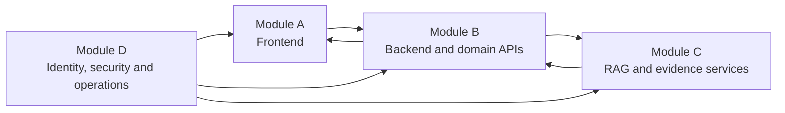

# IP-SAKTI Sahayak — Separate Module Documents

**Team:** Naut IQ  
**Problem Statement:** SIH 26045

The solution is divided into four independently assignable engineering modules:

| Module | Document | Primary responsibility |
|---|---|---|
| **A** | [Frontend and User Experience](./MODULE_A_FRONTEND.md) | Multilingual interface, Product Passport wizard, results, citations and case dashboard |
| **B** | [Backend and Domain Logic](./MODULE_B_BACKEND_DOMAIN.md) | APIs, cases, classification, jurisdiction routing, IP/ABS/regulatory logic and escalation |
| **C** | [AI, RAG and Knowledge System](./MODULE_C_AI_RAG.md) | Corpus ingestion, retrieval, evidence matrix, generation, citations and evaluation |
| **D** | [Security, Administration and Deployment](./MODULE_D_PLATFORM_SECURITY.md) | Authentication, privacy, audit, curator tools, deployment, monitoring and operations |

**Updated 9 September 2026:** All four module documents are revision 2 and incorporate the [research-backed changes](../IP-SAKTI_RESEARCH_AND_SOLUTION.md). These updated specifications take precedence over conflicting details in [the older master blueprint](../IP-SAKTI_PROJECT_BLUEPRINT.md), which is retained for context. The final PPT is unchanged. This is a documentation update, not application implementation.

## Dependency flow

This is a logical dependency flow, not a reason to build sequentially. All four teams can work in parallel after agreeing on API contracts and schemas.

## Recommended build order

1. Freeze shared JSON schemas: Product Passport, classification result, answer, citation and escalation.
2. Module A builds screens against mock APIs.
3. Module B implements cases, rules and domain routing.
4. Module C prepares the corpus and evidence-grounded answer service.
5. Module D supplies local infrastructure, authentication, audit and CI.
6. Integrate `A → B → C`, with Module D controls applied across the entire flow.
7. Run the shared evaluation and demo scenarios. Gold cases and contract tests start in Phase 0, not after integration.

## Shared contracts

The four modules must agree on these objects before coding:

- `ProductPassport`
- `ClassificationResult`
- `JurisdictionContext`
- `GuidanceRequest`
- `GuidanceAnswer`
- `AnswerClaim`
- `Citation`
- `DomainAssessment`
- `EvidenceSupportAssessment`
- `GuidanceEvent`
- `EscalationPacket`
- `SourceVersion`
- `AuditEvent`

Store these contracts in a shared package so frontend and backend types cannot silently diverge.

## SIH ownership suggestion

| Team member/workstream | Module |
|---|---|
| Frontend developer(s) | A |
| Backend/domain developer | B |
| AI/data developer(s) | C |
| DevOps/security/QA owner | D |
| Product/legal-research owner | Supports B and C; validates demo cases and sources |

## Integration definition of done

- A user can create a Product Passport in Module A.
- Module B classifies it and returns reasons plus missing facts.
- Module C returns a cited answer based only on allowed official sources.
- Module D records consent, access and answer provenance.
- India and international claims remain separated.
- Unsupported or high-risk cases clarify, abstain or escalate.
- The case file can be exported with source-version identifiers.
- General-information requests bypass the Passport; decisive extracted facts require confirmation.
- Regulatory, IP and ABS assessments remain independent; unknown conditions never become automatic approvals.
- Only verified legal sections are displayed; one evidence-repair attempt is allowed.
- Current-law applicability uses reviewed effective intervals, not download dates.

## Shared phases

0. Reviewed scope, schemas, sources/rules and initial gold tests.
1. English vertical slice with two reviewed product journeys and general questions.
2. Core verification, independent assessments, corpus change tests and approximately 150 base-case evaluation.
3. Validated Hindi text, then voice and one supported export market.
4. Pilot hardening and measured, permissioned expansion.

Full scope remains the goal; unsupported categories, countries and languages are explicitly labelled until reviewed and tested. No model choice or accuracy target is presented as empirically proven before evaluation.
